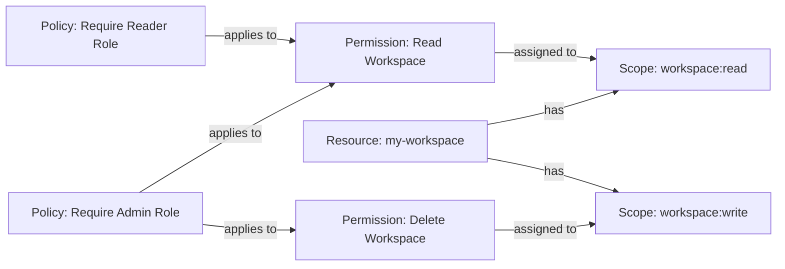

# Protected Resources

*Keycloak Authorization Server* is a powerful tool that provides fine-grained access control to your services and applications. It enables developers to manage **permissions** and **policies** *centrally*, providing a standardized way to secure applications regardless of the platform they are built on.

*Table of Contents*:
[[toc]]

## Example

Let's say we have a workspace management functionality, that allows users to create and manage workspaces.

In this example, we have:

1. An entity named workspace. The entity (aka **resource**) *"my-workspace"* represents a specific workspace in an application.
2. The available actions on the workspace are reading and writing, represented by the **scopes** *"workspace:read"* and *"workspace:write"*.
3. The **permissions** associated with these scopes are *"Read Workspace"* and *"Delete Workspace"*.

The Authorization Server evaluates these permissions to determine whether a user has access to a workspace based on their role and the requested action.

In Keycloak, you can define **resources**, which are the entities that you want to protect. For instance, in the given example, we have a resource named *"my-workspace"* with a type of *"urn:workspaces"*. This resource could represent a workspace in an application that users can access and manipulate.

Keycloak allows you to define **scopes**, which are the actions that can be performed on a resource. In our example, we have two scopes defined: *"workspace:read"* and *"workspace:write"*. These scopes represent the ability to read and write to the workspace.

Keycloak also allows you to define **permissions**, which are the rules that determine who can perform which actions on a resource. In our example, we have two permissions: *"Delete Workspace"* and *"Read Workspace"*. These permissions are linked to specific scopes and are based on policies.

Policies in Keycloak are the conditions that a user must meet to be granted a permission. They can be based on various attributes, including the role of the user, time, and location.

In our example, we have two policies: *"Require Admin Role"* and *"Require Reader Role"*. These policies are based on realm roles, which are roles that apply to the entire Keycloak realm.

To delete a workspace, a user must have the Admin role, as defined by the "Require Admin Role" policy. To read a workspace, a user can have either the Admin role or the Reader role, as defined by the "Require Reader Role" policy.

The *Keycloak Authorization Server* evaluates these policies whenever a user attempts to access a resource. If the user meets the conditions of the policy, the server grants the permission and the user can perform the action on the resource. This allows for powerful, fine-grained access control that can be easily managed and updated as your application evolves.

## Configure Keycloak

> [!NOTE]
> In this section, I'm not going to show you how to setup full example, but rather provide some example, for the full configuration I suggest you looking at the source code. It contains import files that Keycloak allows you to use manually or via CLI.
> 
> * [tests/Keycloak.AuthServices.IntegrationTests/KeycloakConfiguration](https://github.com/NikiforovAll/keycloak-authorization-services-dotnet/tree/main/tests/Keycloak.AuthServices.IntegrationTests/KeycloakConfiguration)
> * [tests/Keycloak.AuthServices.IntegrationTests/docker-compose.yml](https://github.com/NikiforovAll/keycloak-authorization-services-dotnet/tree/main/tests/Keycloak.AuthServices.IntegrationTests/docker-compose.yml)
> * <https://www.keycloak.org/server/importExport>

💡 Here an example of how to create a permission for scopes:

💡 Here is an example of how to create a resource and associate a scopes with it:

💡 Keycloak provides a UI to evaluate permissions for a given resource, user, scopes, etc. This feature enables you to prototype and troubleshoot more easily. Here is an example of how to evaluate permissions for an admin user:

## Add to your code

Here is how to use to use protected resource authorization.

<<< @/../tests/Keycloak.AuthServices.IntegrationTests/AuthorizationServerPolicyTests.cs#RequireProtectedResource_Scopes_Verified

Here are the assertions from the integration test for this scenario:

<<< @/../tests/Keycloak.AuthServices.IntegrationTests/AuthorizationServerPolicyTests.cs#RequireProtectedResource_Scopes_Verified_Assertion

Source code of integration test: [tests/Keycloak.AuthServices.IntegrationTests/AuthorizationServerPolicyTests.cs](https://github.com/NikiforovAll/keycloak-authorization-services-dotnet/blob/main/tests/Keycloak.AuthServices.IntegrationTests/AuthorizationServerPolicyTests.cs)

## Validate Multiple Scopes

You can specify multiple scopes to validate against and control comparison by using `ScopesValidationMode`.

Here is an example for `ScopesValidationMode.AllOf`:

<<< @/../tests/Keycloak.AuthServices.IntegrationTests/AuthorizationServerPolicyTests.cs#RequireProtectedResource_MultipleScopesAllOf_Verified

Here is an example for `ScopesValidationMode.AnyOf`:

<<< @/../tests/Keycloak.AuthServices.IntegrationTests/AuthorizationServerPolicyTests.cs#RequireProtectedResource_MultipleScopesAnyOf_Verified
