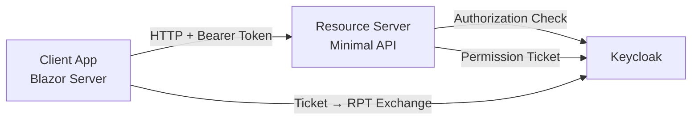
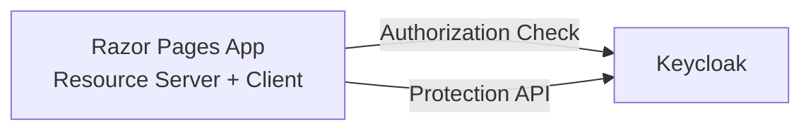

# UMA Resource Sharing

This example demonstrates **UMA 2.0 (User-Managed Access)** — an OAuth-based protocol for resource owner-controlled access. Two sample apps show different architecture patterns.

> [!TIP]
> For UMA concepts and setup details, see the [UMA 2.0 documentation](/protection-api/uma).

## Test Users

| Username | Password | Role |
|---|---|---|
| `alice` | `alice` | Resource Owner — has full access to `shared-document` |
| `bob` | `bob` | Requesting Party — no access by default |

## Running

```bash
dotnet run --project samples/UmaResourceSharing/AppHost
```

The Aspire dashboard opens automatically. Navigate to either app to interact with the UMA flow.

## Blazor + Resource Server

Two-project setup: Blazor Server client communicates with a separate Minimal API resource server. The `UmaTokenHandler` transparently handles 401+UMA challenge-response between the two.



### Resource Server

<<< @/../samples/UmaResourceSharing/ResourceServer/Program.cs

### Client App

<<< @/../samples/UmaResourceSharing/ClientApp/Program.cs

### Demo Walkthrough

1. **alice (owner)** — Login → Documents → Access (read) → UMA Challenge → RPT → Access Granted
2. **bob (denied)** — Login → Documents → Access (read) → UMA Challenge → Access Denied
3. **bob requests access** → Request Access (read) → "Request submitted" → alice logs in → Approves → bob retries → Access Granted

See sample source code: [samples/UmaResourceSharing/ClientApp](https://github.com/NikiforovAll/keycloak-authorization-services-dotnet/tree/main/samples/UmaResourceSharing/ClientApp)

## Razor Pages (Self-Contained)

Single-project setup: the Razor Pages app **is** the resource server. Authorization checks and permission ticket management happen inline — no separate API, no `UmaTokenHandler`.



### Program.cs

<<< @/../samples/UmaResourceSharing/RazorPagesApp/Program.cs

### Protected Page — Programmatic Authorization Check

<<< @/../samples/UmaResourceSharing/RazorPagesApp/Pages/Documents/Details.cshtml.cs

### Permission Request — Direct Protection API Usage

<<< @/../samples/UmaResourceSharing/RazorPagesApp/Pages/Documents/Index.cshtml.cs

### Permission Management — Approve / Deny

<<< @/../samples/UmaResourceSharing/RazorPagesApp/Pages/Permissions/Index.cshtml.cs

### Demo Walkthrough

1. **alice (owner)** — Login → Documents → Access (read) → Content displayed
2. **bob (denied)** — Login → Documents → Access (read) → "Access Denied" page
3. **bob requests access** → Request Access (read) → "Request submitted" → alice logs in → Permissions → Approve → bob retries → Content displayed

See sample source code: [samples/UmaResourceSharing/RazorPagesApp](https://github.com/NikiforovAll/keycloak-authorization-services-dotnet/tree/main/samples/UmaResourceSharing/RazorPagesApp)

::: details Keycloak Realm Configuration
<<< @/../samples/UmaResourceSharing/AppHost/KeycloakConfiguration/Test-realm.json
:::
