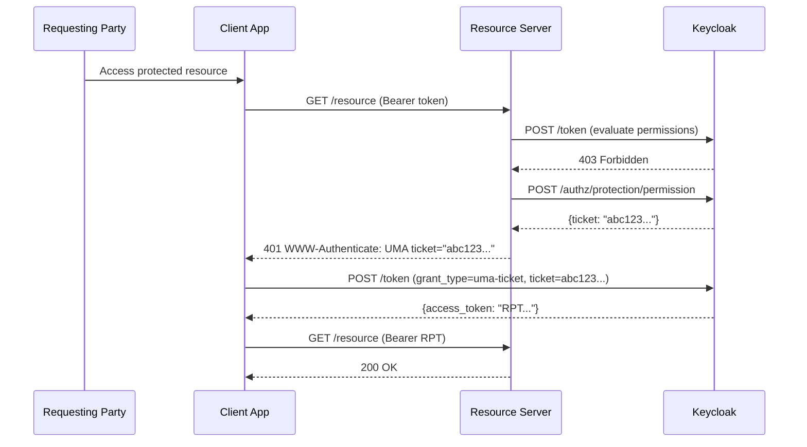
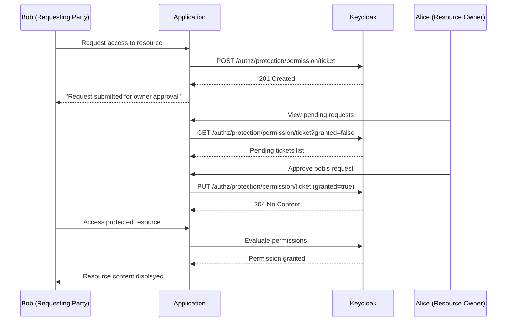
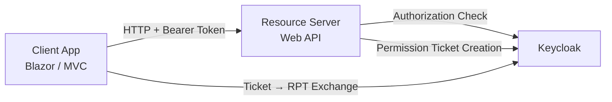
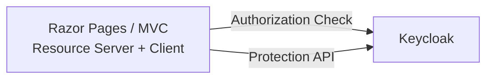

# UMA 2.0 (User-Managed Access)

**User-Managed Access (UMA)** is an OAuth-based protocol that enables a resource owner to control access to their protected resources. Unlike traditional OAuth where the resource server decides access, UMA introduces an asynchronous approval model — a user can request access to a resource, and the resource owner can review and approve (or deny) that request later.

[[toc]]

## Demo

### Login & Resource Owner Access


### Request Access & Owner Approval


### Access Denied (Insufficient Permissions)


## Key Concepts

| Concept | Description |
|---|---|
| **Resource Owner** | The user who owns the protected resource (e.g., alice) |
| **Requesting Party** | A user who wants to access someone else's resource (e.g., bob) |
| **Resource Server** | The API that hosts and protects resources |
| **Authorization Server** | Keycloak — evaluates policies and issues permission tickets and RPTs |
| **Permission Ticket** | A one-time challenge token representing an access request |
| **RPT (Requesting Party Token)** | An access token enriched with specific resource permissions |
| **Permission Request** | A pending approval request created via the Protection API Permission Ticket endpoint |

> [!TIP]
> See Keycloak's documentation — [Authorization Services: UMA](https://www.keycloak.org/docs/latest/authorization_services/index.html#_service_protection_api) for the full protocol specification.

## UMA Challenge-Response Flow

The core UMA flow is a challenge-response mechanism between the client, resource server, and Keycloak:



## Async Approval Flow

When a user has no permission, they can submit a permission request. The resource owner reviews and approves it later:



## Architecture Patterns

Keycloak.AuthServices supports two architecture patterns for UMA:

### Pattern 1: Separate Resource Server (Web API + Client)

The client app and resource server are separate projects. A `UmaTokenHandler` (DelegatingHandler) transparently intercepts 401+UMA challenges between the client and the API.



**Use when:** You have a dedicated Web API that multiple clients consume.

**Key components:**
- Resource Server uses `AddUmaPermissionTicketChallenge()` to return `WWW-Authenticate: UMA` on authorization failure
- Client uses `UmaTokenHandler` from `Keycloak.AuthServices.Authorization.Uma` to handle the ticket-for-RPT exchange transparently
- Protected endpoints use `.RequireProtectedResource("resource", "scope")`

### Pattern 2: Self-Contained (Single App)

The app **is** the resource server — authorization checks and permission ticket management happen inline. No HTTP calls to intercept.



**Use when:** Your app serves both the UI and the protected resources directly.

**Key components:**
- Authorization policies checked programmatically via `IAuthorizationService`
- Permission tickets managed directly via `IKeycloakProtectionClient`
- No `UmaTokenHandler` or `AddUmaPermissionTicketChallenge()` needed

## Setup

### Packages

```bash
dotnet add package Keycloak.AuthServices.Authorization
dotnet add package Keycloak.AuthServices.Sdk
```

For the separate resource server pattern, also add:

```bash
dotnet add package Keycloak.AuthServices.Authorization.Uma
```

### Separate Resource Server Pattern

**Resource Server** — protects endpoints and returns UMA challenges:

```csharp
// Authorization + UMA challenge handler
services.AddAuthorization().AddKeycloakAuthorization().AddUmaPermissionTicketChallenge();

services.AddAuthorizationServer(configuration).AddStandardResilienceHandler();

// Protection API client for permission ticket management
services.AddKeycloakProtectionHttpClient(configuration)
    .AddClientCredentialsTokenHandler(tokenClientName);

// Protected endpoints
app.MapGet("/documents/{name}", (string name) => new { name })
    .RequireProtectedResource("shared-document", "read");
```

**Client App** — handles UMA challenge-response transparently:

```csharp
// Register UMA ticket exchange client
services.AddKeycloakUmaTicketExchangeHttpClient(configuration);

// HTTP client with UMA token handler
services.AddHttpClient("ResourceServer", client =>
    {
        client.BaseAddress = new Uri("https://resource-server");
    })
    .AddUmaTokenHandler();
```

The `UmaTokenHandler` automatically:
1. Attaches the user's access token to outgoing requests
2. Detects `401` responses with `WWW-Authenticate: UMA` headers
3. Extracts the permission ticket from the header
4. Exchanges the ticket for an RPT via Keycloak's token endpoint
5. Retries the original request with the RPT

### Self-Contained Pattern

A single app acts as both the OIDC client and the resource server:

```csharp
// OIDC authentication (cookie-based, for browser login)
services.AddAuthentication(options =>
    {
        options.DefaultScheme = CookieAuthenticationDefaults.AuthenticationScheme;
        options.DefaultChallengeScheme = OpenIdConnectDefaults.AuthenticationScheme;
    })
    .AddKeycloakWebApp(configuration.GetSection("Keycloak"),
        configureOpenIdConnectOptions: options =>
        {
            options.SaveTokens = true;
            options.MapInboundClaims = false; // keep "sub" claim name
        });

// Keycloak authorization with named policies
services.AddAuthorization()
    .AddKeycloakAuthorization()
    .AddAuthorizationBuilder()
    .AddPolicy("UmaRead", policy =>
        policy.RequireProtectedResource("shared-document", "read"))
    .AddPolicy("UmaWrite", policy =>
        policy.RequireProtectedResource("shared-document", "write"));

// Authorization server client (evaluates permissions against Keycloak)
services.AddAuthorizationServer(options =>
    {
        configuration.GetSection("Keycloak").BindKeycloakOptions(options);
        options.Resource = "uma-resource-server";
        options.Credentials = new() { Secret = "uma-resource-server-secret" };
    })
    .AddStandardResilienceHandler();

// Protection API client (permission ticket management)
services.AddKeycloakProtectionHttpClient(options =>
    {
        configuration.GetSection("Keycloak").BindKeycloakOptions(options);
        options.Resource = "uma-resource-server";
        options.Credentials = new() { Secret = "uma-resource-server-secret" };
    })
    .AddClientCredentialsTokenHandler(tokenClientName);
```

> [!IMPORTANT]
> When using cookie authentication with `IAuthorizationService`, set `MapInboundClaims = false` in the OIDC options to preserve the `sub` claim name. Otherwise, the OIDC middleware maps it to a long .NET claim URI and `User.FindFirstValue("sub")` returns null.

#### Programmatic Authorization Checks

In the self-contained pattern, use `IAuthorizationService` to check permissions in page handlers instead of page-level `[Authorize(Policy=...)]` attributes (which would return a raw 401 to the browser):

```csharp
[Authorize]
public class DetailsModel(IAuthorizationService authorizationService) : PageModel
{
    public bool AccessGranted { get; set; }

    public async Task OnGetAsync(string name, string scope = "read")
    {
        var policyName = scope == "write" ? "UmaWrite" : "UmaRead";
        var result = await authorizationService.AuthorizeAsync(User, policyName);

        if (result.Succeeded)
        {
            AccessGranted = true;
        }
    }
}
```

#### Permission Ticket Management

Use `IKeycloakProtectionClient` directly for creating, listing, approving, and denying permission requests:

```csharp
// Create a permission request
var ticket = new PermissionTicket
{
    Resource = resourceId,
    Requester = userId,
    ScopeName = "read",
    Granted = false,
};
await protectionClient.CreateStoredPermissionTicketWithResponseAsync(realm, ticket);

// List pending tickets
var tickets = await protectionClient.GetPermissionTicketsAsync(realm,
    new GetPermissionTicketsRequestParameters { Granted = false, ReturnNames = true });

// Approve a ticket
await protectionClient.UpdatePermissionTicketAsync(realm,
    new PermissionTicket { Id = ticketId, Granted = true });

// Deny (delete) a ticket
await protectionClient.DeletePermissionTicketAsync(realm, ticketId);
```

## Keycloak Configuration

UMA requires specific Keycloak setup:

1. **Resource Server Client** — a confidential client with **Authorization Services** enabled
2. **UMA Resource** — a resource with `ownerManagedAccess: true` and defined scopes (e.g., `read`, `write`)
3. **Owner Policy** — grants the resource owner full access
4. **OIDC Client** — for user login (with audience mapper for the resource server client)

> [!TIP]
> The [UMA Resource Sharing samples](https://github.com/NikiforovAll/keycloak-authorization-services-dotnet/tree/main/samples/UmaResourceSharing) include pre-configured Keycloak realm exports with all required clients, resources, and policies.

## Samples

| Sample | Pattern | Description |
|---|---|---|
| [Blazor + Resource Server](/examples/uma-resource-sharing#blazor-resource-server) | Separate | Blazor Server client + Minimal API resource server. `UmaTokenHandler` handles 401+UMA challenges transparently. |
| [Razor Pages (Self-Contained)](/examples/uma-resource-sharing#razor-pages-self-contained) | Self-Contained | Single Razor Pages app. Uses `IAuthorizationService` for inline checks and `IKeycloakProtectionClient` for ticket management. |
