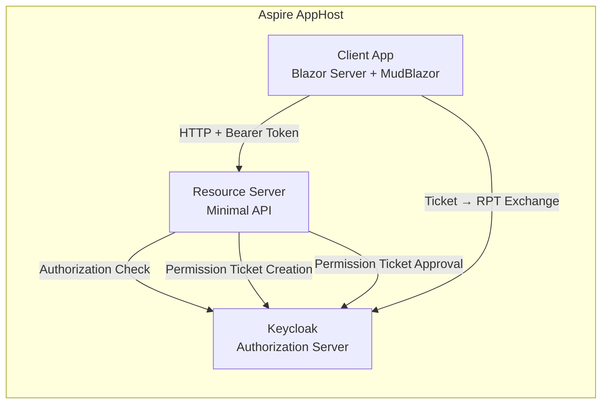
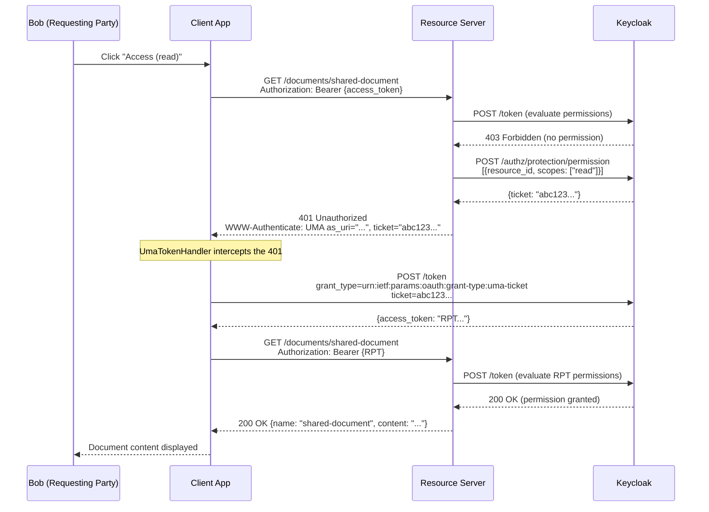
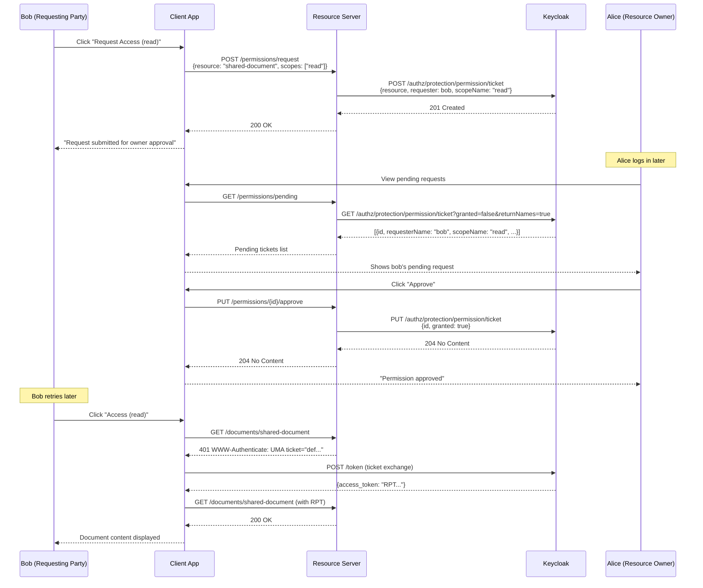

# UMA Resource Sharing Sample

This sample demonstrates the **UMA 2.0 (User-Managed Access)** async approval flow using Keycloak Authorization Services for .NET.

## What is UMA?

**User-Managed Access (UMA)** is an OAuth-based protocol that enables a resource owner to control access to their protected resources. Unlike traditional OAuth where the resource server decides access, UMA introduces an asynchronous approval model — a user can request access to a resource, and the resource owner can review and approve (or deny) that request later, without needing to be online at the time of the request.

### Key Concepts

| Concept                          | Description                                                                          |
| -------------------------------- | ------------------------------------------------------------------------------------ |
| **Resource Owner**               | The user who owns the protected resource (e.g., alice)                               |
| **Requesting Party**             | A user who wants to access someone else's resource (e.g., bob)                       |
| **Resource Server**              | The API that hosts and protects resources                                            |
| **Authorization Server**         | Keycloak — evaluates policies and issues permission tickets and RPTs                 |
| **Permission Ticket**            | A one-time challenge token representing an access request                            |
| **RPT (Requesting Party Token)** | An access token enriched with specific resource permissions                          |
| **Permission Request**           | A pending approval request created via the Protection API Permission Ticket endpoint |

## Architecture



- **AppHost** — Aspire orchestration (Keycloak container + two .NET apps)
- **ResourceServer** — Minimal API protected with `RequireProtectedResource()`. Uses `AddUmaPermissionTicketChallenge()` to return `WWW-Authenticate: UMA` on authorization failure
- **ClientApp** — Blazor Server with MudBlazor UI. Uses `UmaTokenHandler` from `Keycloak.AuthServices.Authorization.Uma` to transparently intercept 401 UMA challenges and handle ticket-for-RPT exchange

## UMA Permission Ticket Flow

The core UMA flow involves a challenge-response mechanism between the client, resource server, and Keycloak:



## Async Approval Flow (Permission Ticket API)

When a user without permission clicks **"Request Access"**, the client creates a permission ticket directly via the Protection API:



## Demo Walkthrough

### Test Users

| Username | Password | Role             | Description                                                               |
| -------- | -------- | ---------------- | ------------------------------------------------------------------------- |
| `alice`  | `alice`  | Resource Owner   | Has full access to `shared-document` via a pre-configured Keycloak policy |
| `bob`    | `bob`    | Requesting Party | No access by default — must request and be approved by alice              |

### Scenario 1: Regular UMA Challenge (alice — owner)

1. **Login as alice** → Navigate to **Documents**
2. **Access (read)** → UMA Challenge → Ticket Exchange → RPT → **Access Granted** (owner policy)

### Scenario 2: Access Denied (bob — no permission)

1. **Login as bob** → Navigate to **Documents**
2. **Access (read)** → UMA Challenge → Ticket Exchange → **Access Denied** (no policy)

### Scenario 3: Request Submission + Approval

1. **Login as bob** → **Request Access (read)** → **Request Submitted**
2. **Logout** → **Login as alice** → Click refresh on **Pending Permission Requests** → See bob's request → **Approve**
3. **Logout** → **Login as bob** → **Access (read)** → UMA Challenge → RPT → **Access Granted**

### What to Observe

- **"Access" buttons** test the regular UMA challenge-response — the `UmaTokenHandler` handles the 401 → ticket exchange → RPT flow transparently
- **"Request Access" buttons** create permission tickets directly via the Protection API — these appear as pending requests for the resource owner
- Resource owners see and manage pending requests via the Keycloak Permission Ticket API

## Key Implementation Details

### Resource Server Setup

```csharp
// Keycloak authorization + UMA challenge handler
services
    .AddAuthorization()
    .AddKeycloakAuthorization()
    .AddUmaPermissionTicketChallenge();

services.AddAuthorizationServer(configuration).AddStandardResilienceHandler();

// Protection API client — for permission ticket management and UMA challenges
services.AddKeycloakProtectionHttpClient(configuration)
    .AddClientCredentialsTokenHandler(tokenClientName);

// Protected endpoints — scopes enforced via Keycloak authorization server
app.MapGet("/documents/{name}", ...)
    .RequireProtectedResource("shared-document", "read");

// Permission ticket management endpoints
app.MapGet("/permissions/pending", ...)     // List pending tickets
app.MapPut("/permissions/{id}/approve", ...) // Approve a ticket
app.MapDelete("/permissions/{id}", ...)      // Deny/delete a ticket
```

### Client App — UMA Token Handler

The `UmaTokenHandler` from `Keycloak.AuthServices.Authorization.Uma` is a `DelegatingHandler` that handles the UMA challenge-response flow transparently:

1. Attaches the user's access token to outgoing requests
2. Detects `401` responses with `WWW-Authenticate: UMA` headers
3. Extracts the permission `ticket` from the header
4. Exchanges the ticket for an RPT via `IUmaTicketExchangeClient`
5. Retries the original request with the RPT

For async approval (permission request submission), the client calls the Resource Server's `/permissions/request` endpoint directly, which uses `IKeycloakProtectionClient` to create permission tickets via the Protection API.

```csharp
// Register UMA ticket exchange client
services.AddKeycloakUmaTicketExchangeHttpClient(configuration);

// Attach UMA token handler to the ResourceServer HTTP client
services.AddHttpClient("ResourceServer", ...)
    .AddUmaTokenHandler();
```

### Keycloak Configuration

The realm is pre-configured with:

- **`uma-resource-server`** — confidential client with authorization services enabled
- **`uma-client-app`** — OIDC client for the Blazor app (with audience mapper for `uma-resource-server`)
- **`shared-document`** — a UMA resource with `ownerManagedAccess: true` and scopes `read`, `write`
- **Owner policy** — grants alice full access to the resource
- Permission requests are created and approved via the Protection API (Permission Ticket endpoints)

## Running

```bash
dotnet run --project AppHost
```

The Aspire dashboard opens automatically. Navigate to the **Client App** URL to interact with the UMA flow.

> **Note**: The first request after startup may fail with `401` (JWT bearer authentication needs to fetch Keycloak's JWKS). Retry and the flow works as expected.
