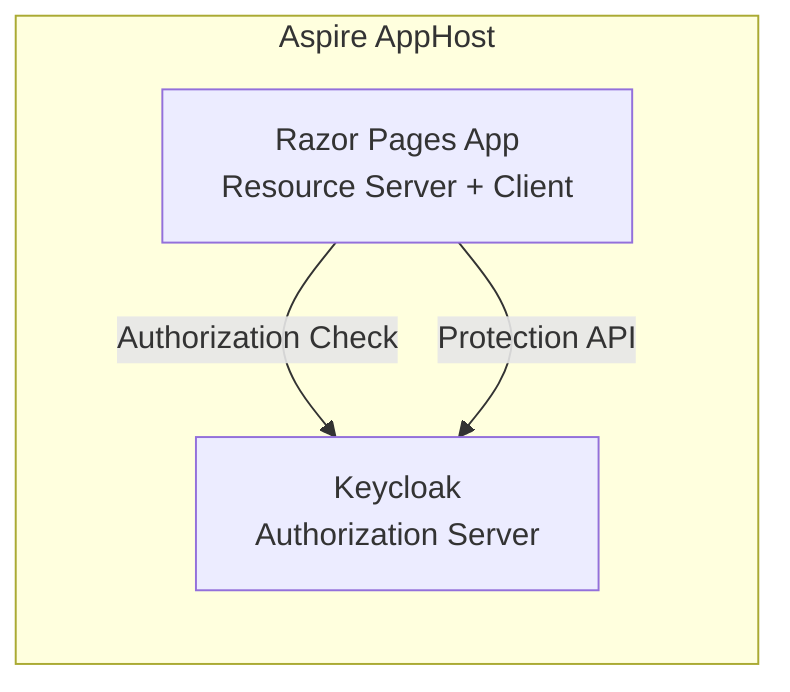
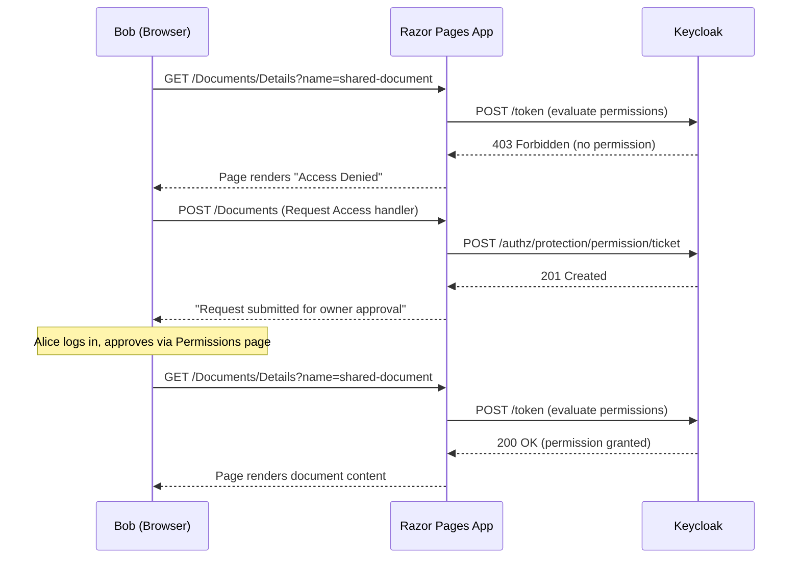

# UMA Resource Sharing — Razor Pages (Self-Contained)

This sample demonstrates UMA 2.0 using a single Razor Pages app that acts as **both the resource server and the client**. There is no separate WebAPI project.

## Architecture



## Key Difference from Blazor Sample

In the **Blazor sample**, a `UmaTokenHandler` (DelegatingHandler) transparently intercepts HTTP 401+UMA challenges between the Blazor client and a separate Resource Server API.

In this **Razor Pages sample**, the app **is** the resource server:
- Authorization policies (`UmaRead`, `UmaWrite`) use `RequireProtectedResource()` — evaluated via `IAuthorizationService` in page handlers
- Permission ticket management (request, approve, deny) uses `IKeycloakProtectionClient` directly in page models
- No HTTP client, no DelegatingHandler, no 401 interception

## UMA Flow in Razor Pages



## Pages

| Page | Purpose |
|------|---------|
| `/` | Home — explains the UMA flow and test users |
| `/Documents` | Lists protected documents, access buttons, request access forms |
| `/Documents/Details` | Protected page — checks authorization inline, shows content or "Access Denied" |
| `/Permissions` | Pending permission requests — approve/deny (resource owner view) |

## Service Registration

```csharp
// OIDC authentication (cookie-based, for browser login)
services.AddAuthentication(...)
    .AddKeycloakWebApp(configuration.GetSection("Keycloak"), ...);

// Keycloak authorization with named policies
services.AddAuthorization()
    .AddKeycloakAuthorization()
    .AddAuthorizationBuilder()
    .AddPolicy("UmaRead", policy => policy.RequireProtectedResource("shared-document", "read"))
    .AddPolicy("UmaWrite", policy => policy.RequireProtectedResource("shared-document", "write"));

// Authorization server client (evaluates permissions against Keycloak)
services.AddAuthorizationServer(protectionSection);

// Protection API client (permission ticket management)
services.AddKeycloakProtectionHttpClient(protectionSection)
    .AddClientCredentialsTokenHandler(tokenClientName);
```

## Configuration

The app uses two Keycloak config sections:

- `Keycloak` — OIDC client (`uma-client-app`) for user login
- `KeycloakProtection` — Resource server client (`uma-resource-server`) for authorization + Protection API

## Demo Walkthrough

### Scenario 1: alice (owner) — Access Granted

1. Login as **alice** → Documents → **Access (read)** → Content displayed

### Scenario 2: bob (no permission) — Access Denied

1. Login as **bob** → Documents → **Access (read)** → "Access Denied" page

### Scenario 3: Request + Approval Flow

1. Login as **bob** → Documents → **Request Access (read)** → "Request submitted"
2. Logout → Login as **alice** → Permissions → **Approve** bob's request
3. Logout → Login as **bob** → Documents → **Access (read)** → Content displayed
